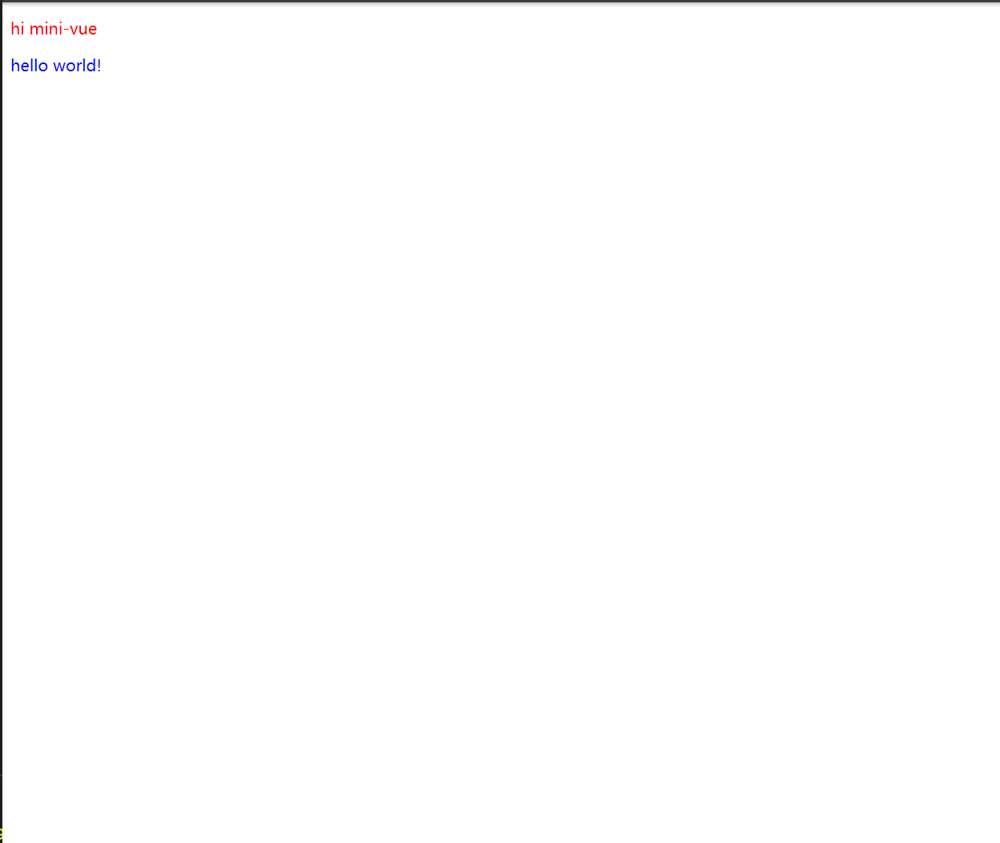

# Hello! This is mini-vue, a tiny framework based on vue3

## BASIC DEMO

*app.js*
```javascript
window.self = null;
export const App = {
  render() {
    window.self = this;
    return h("div", { id: "root", class: ["red", "hard"] }, [
      h("p", { class: "red" }, "hi  " + this.msg),
      h("p", { class: "blue" }, "hello world!"),
    ]);
  },
  setup() {
    return {
      msg: "mini-vue",
    };
  },
};
```

*main.js*
```javascript
import { createApp } from "../../lib/guide-mini-vue.esm.js";
import {App} from "./App.js";

const rootContainer = document.querySelector("#app");
createApp(App).mount(rootContainer);
```
*index.html*
```javascript
<!DOCTYPE html>
<html lang="en">
  <head>
    <meta charset="UTF-8" />
    <meta name="viewport" content="width=device-width, initial-scale=1.0" />
    <title>Document</title>
  </head>
  <body>
    <div id="app"></div>
    <script src="./main.js" type="module"></script>
  </body>
  <style>
    .red {
      color: red;
    }
    .blue {
      color: blue;
    }
  </style>
</html>
```
here is the result scene

